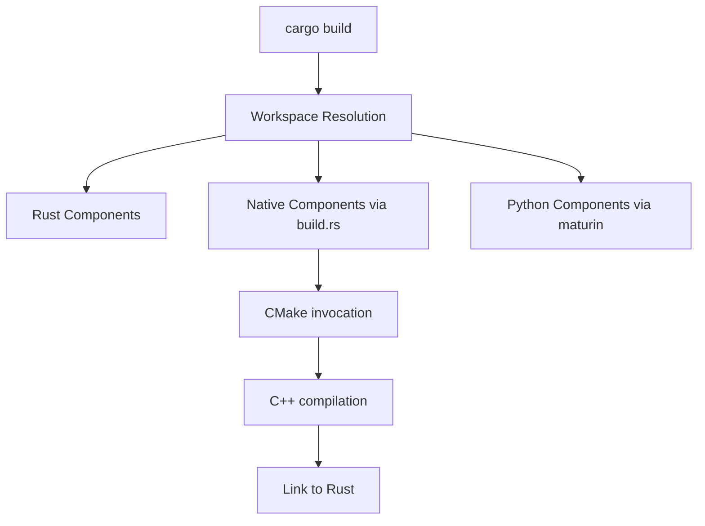

# ARCHITECTING

## When This Applies
You are in ARCHITECTING stage when:
- Designing system architecture
- Making technical decisions
- Resolving design conflicts
- Creating component interfaces
- Evaluating build/buy decisions

## Decision Hierarchy

When making architectural decisions, validate against this hierarchy:

```
┌─────────────────────────────────────┐  ← HIGHEST PRIORITY
│        BUSINESS GOALS               │
│ "ADA as AI Agent debugging platform"│
└─────────────────────────────────────┘
                  ↓
┌─────────────────────────────────────┐
│          USER STORIES               │
│    "What users need to achieve"     │
└─────────────────────────────────────┘
                  ↓
┌─────────────────────────────────────┐
│        TECHNICAL SPECS              │
│     "How to implement features"     │
└─────────────────────────────────────┘
                  ↓
┌─────────────────────────────────────┐  ← LOWEST PRIORITY
│         IMPLEMENTATION              │
│    "Code, tests, build scripts"     │
└─────────────────────────────────────┘
```

## System Architecture Principles

### Component Organization

```
project-root/
├── Cargo.toml           # Root orchestrator - SINGLE DRIVER
├── tracer/              # Rust control plane
├── tracer_backend/      # C/C++ data plane (CMake via build.rs)
├── query_engine/        # Python analysis (maturin via build.rs)
└── mcp_server/          # Python MCP interface
```

### Build Orchestration Architecture



**Key Rules:**
1. **Cargo drives everything** - Never bypass Cargo
2. **build.rs orchestrates native code** - CMake is a leaf, not a driver
3. **Predictable output locations** - All artifacts in target/
4. **Workspace dependencies** - Consistent versions

### Memory Architecture Patterns

**❌ WRONG: Unstructured tail allocation**
```c
uint8_t* tail = memory + sizeof(Header);
tail += size;  // Undebuggable pointer arithmetic
```

**✅ RIGHT: Explicit structured layouts**
```cpp
struct MemoryLayout {
    Header header;
    alignas(64) Data data[COUNT];
    alignas(64) Queue queues[QUEUE_COUNT];
};
```

Use CRTP for complex tail allocation (LLVM-style):
```cpp
class Registry : public TrailingObjects<Registry, Lane, Queue> {
    // Type-safe tail allocation
};
```

## Interface Design Requirements

### Language-Specific Patterns

**C/C++ Interfaces:**
- Complete header files with all types defined
- No forward declarations without implementation
- Include guards and extern "C" for FFI
- Debug dump functions for complex structures

**Rust Interfaces:**
- Trait definitions before implementation
- Associated types for generic constraints
- #[repr(C)] for FFI structs
- Safety documentation for unsafe blocks

**Python Interfaces:**
- Protocol/ABC definitions first
- Type hints for all parameters
- Docstrings with examples
- Pybind11/ctypes for native binding

### Cross-Language FFI

```rust
// Rust side
#[repr(C)]
pub struct ThreadRegistry { ... }

#[no_mangle]
pub extern "C" fn thread_registry_init(...) { ... }
```

```c
// C side (generated via cbindgen)
typedef struct ThreadRegistry ThreadRegistry;
ThreadRegistry* thread_registry_init(...);
```

## Architectural Decision Records (ADRs)

When making significant architectural changes:

```markdown
# ADR-XXX: Title

## Status: [Proposed|Accepted|Deprecated]

## Context
What situation led to this decision?

## Decision
What are we doing?

## Consequences
- ✅ Positive outcomes
- ❌ Negative impacts
- 🔄 Trade-offs

## Alternatives Considered
What else did we evaluate?
```

## Quality Attributes

Every architectural decision must consider:

1. **Performance**: <1μs registration, <10ns fast path
2. **Scalability**: 64 threads, 1M events/sec
3. **Debuggability**: Structured layouts, debug helpers
4. **Maintainability**: Clear interfaces, minimal coupling
5. **Testability**: Mock-friendly, deterministic
6. **Security**: Platform security boundaries respected

## Common Architectural Patterns

### Lock-Free SPSC Queues
```c
// Producer (single thread)
atomic_store(&tail, (tail + 1) % size, memory_order_release);

// Consumer (single thread)
atomic_load(&head, memory_order_acquire);
```

### Dual-Lane Architecture
- **Index Lane**: Always-on, lightweight events
- **Detail Lane**: Selective persistence, rich data

### Thread-Local Storage Optimization
```c
__thread ThreadLaneSet* tls_my_lanes = NULL;
// Fast path: no atomic operations needed
```

## Validation Checklist

Before finalizing architecture:

□ **Business Alignment**: Supports AI agent debugging?
□ **User Story Coverage**: Addresses documented needs?
□ **Technical Compliance**: Meets FR requirements?
□ **Performance Impact**: Within latency budgets?
□ **Complexity Trade-off**: Simpler alternative exists?
□ **Cross-Platform**: Works on macOS/Linux?
□ **Debuggability**: Can developers understand failures?
□ **Evolution Path**: Can be extended without breaking?

## Red Flags

If you're:
- Bypassing Cargo orchestration
- Creating monolithic components
- Using raw pointer arithmetic
- Ignoring platform differences
- Adding unnecessary dependencies
- Creating untestable architectures

STOP! You're violating architectural principles.